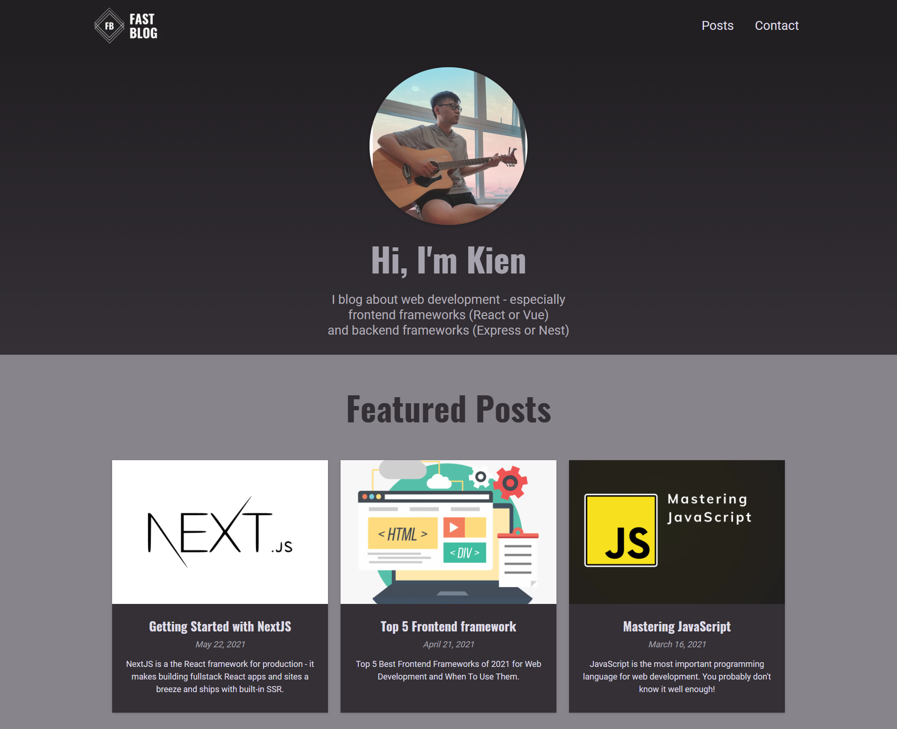
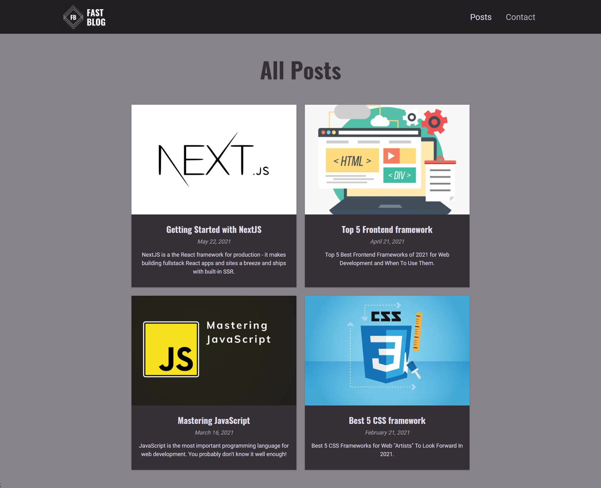
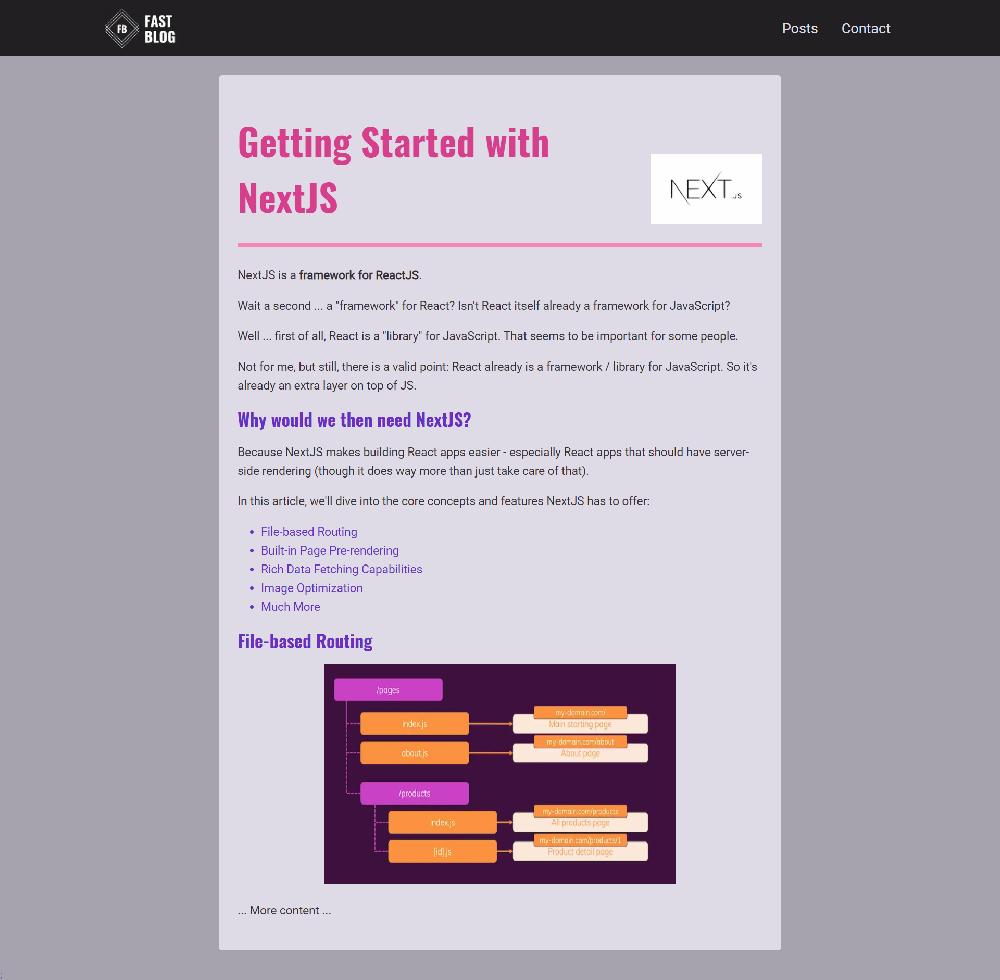

# Kien' Fast Blog 

## Description
This is a blog that using markdown file to create content for posts.
Therefore, it's easier to write and edit content as well as don't need writing content features in the app.

## Technology
- Frontend
  - React - A JavaScript library for building user interfaces
  - React-Markdown - Markdown Parser
- Backend
  - NextJS - Server Side Rendering
  - Create-next-app - NextJS Starter Template

## Some preview images



## Setup
First, create a `.env.local` file with the template file `.env.local.example`.

After that, run the development server:

```bash
npm run dev
# or
yarn dev
```

Open [http://localhost:3000](http://localhost:3000) with your browser to see the result.

You can start editing the page by modifying `pages/index.js`. The page auto-updates as you edit the file.

[API routes](https://nextjs.org/docs/api-routes/introduction) can be accessed on [http://localhost:3000/api/hello](http://localhost:3000/api/hello). This endpoint can be edited in `pages/api/hello.js`.

The `pages/api` directory is mapped to `/api/*`. Files in this directory are treated as [API routes](https://nextjs.org/docs/api-routes/introduction) instead of React pages.

## Learn More

To learn more about Next.js, take a look at the following resources:

- [Next.js Documentation](https://nextjs.org/docs) - learn about Next.js features and API.
- [Learn Next.js](https://nextjs.org/learn) - an interactive Next.js tutorial.

# License & copyright

© Kirin Tran, FPT University TP.HCM
Licensed under the [MIT LICENSE](LICENSE).